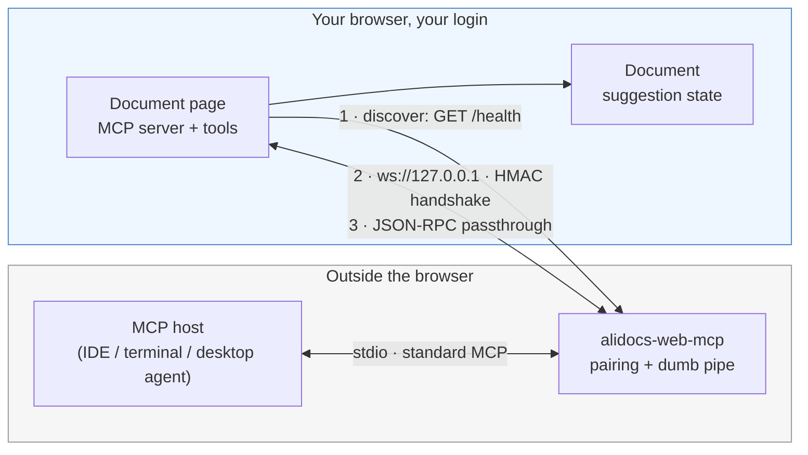
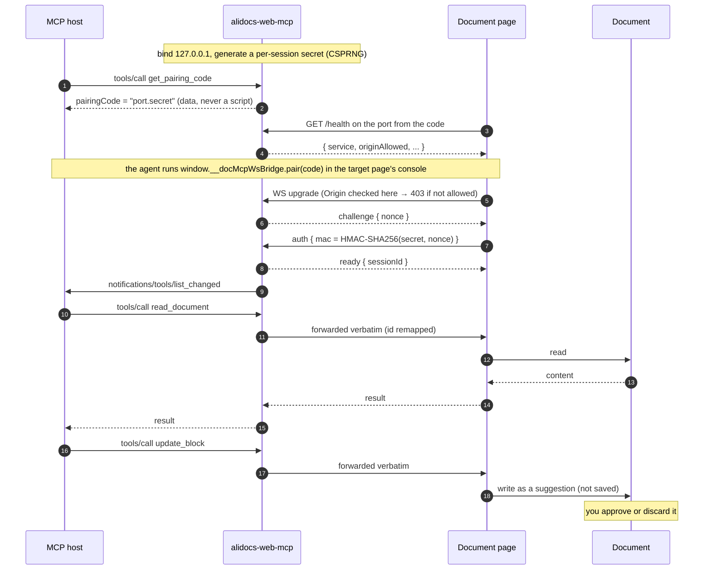

# alidocs-web-mcp

**Let your AI agent read and edit the DingTalk Doc you already have open — in your own browser, under your own login, with every change landing as a suggestion you approve or discard.**

[](https://www.npmjs.com/package/@magical-index/alidocs-web-mcp)
[](https://github.com/magical-index/alidocs-web-mcp/actions/workflows/ci.yml)
[](./LICENSE)
[](https://nodejs.org)

[中文文档](./README.zh-CN.md)

---

## Why this exists

You are editing a document in your browser. Your AI agent lives somewhere else — an IDE, a terminal, a desktop app. To let the agent help, you normally have two bad options:

| Option | Why it falls short |
| --- | --- |
| Server-side document API | Cannot express *block-level suggestions* awaiting human review, and needs its own credentials and permission plumbing |
| Give the agent its own browser | Splits your session in two: the document you are looking at is not the document the agent drives |

The capability you actually want — structured, block-level editing that renders as a **reviewable suggestion** — only exists inside the page runtime. So instead of recreating it elsewhere, this tool connects your agent *to the page you already have open*.

**The direction is inverted on purpose.** The page dials out to a local process; the local process never reaches into your browser. That is what makes it work without debug ports, browser extensions, or any change to your agent's host application.

## What you get

- **Standard MCP over stdio** — works with any MCP host (IDE, terminal, desktop agent). No custom protocol to adopt.
- **Zero runtime dependencies** — plain Node ≥ 22.12, hand-rolled WebSocket framing. `npx` and go.
- **Zero code injection** — the pairing credential is *data*, never a script. Nothing is ever `eval`'d.
- **Read-only by default** — writes require an explicit flag, and land as suggestions rather than saved edits.
- **Loopback only** — binds `127.0.0.1`, enforces an Origin allowlist, and authenticates with an HMAC challenge-response.

## Requirements

> [!IMPORTANT]
> This bridge is **half of a pair**. The document page must ship a matching connector that discovers the bridge and, when the agent tells it to, pairs. The connector does not pop any UI on its own; the agent initiates pairing by calling `window.__docMcpWsBridge.pair(code)` in that page. Without the connector, the bridge starts fine but no document tools will ever appear.
>
> As of now that connector is not yet generally available in production DingTalk Docs. If `get_bridge_status` keeps reporting `connected: false` while the bridge is clearly running, this is almost certainly why — not a misconfiguration on your side.

- Node.js ≥ 22.12 (ESM-only package; `require()` from CommonJS works on 22.12+)
- A DingTalk Doc page open in a browser, with the page-side connector present

## Install & run

**One-click install** (checks Node, warms the npx cache, registers the MCP server):

```bash
curl -fsSL https://raw.githubusercontent.com/magical-index/alidocs-web-mcp/main/install.sh | sh
# allow write tools:
curl -fsSL https://raw.githubusercontent.com/magical-index/alidocs-web-mcp/main/install.sh | sh -s -- --allow-write
```

It auto-registers into **Claude Code** (`claude mcp add --scope user`) when the `claude` CLI is present, and prints a paste-ready JSON snippet for **Qoder** (Settings → MCP → **+ Add**). Run `install.sh --help` for options (`--name`, `--force`, `--skip-verify`).

Or register it with your MCP host manually — no global install needed:

```json
{
  "mcpServers": {
    "alidocs-web-mcp": {
      "command": "npx",
      "args": ["-y", "@magical-index/alidocs-web-mcp", "--allow-write"]
    }
  }
}
```

Or run it directly:

```bash
npx -y @magical-index/alidocs-web-mcp              # read-only
npx -y @magical-index/alidocs-web-mcp --allow-write # allow the page to register write tools
```

By default the bridge tries ports **19837 → 19838 → 19839** and takes the first free one. The port is no longer an *identity*, though: since 0.2.0 the pairing code is `<port>.<secret>`, so the page connects straight to the port named in the code instead of probing the candidate list.

### Several agents at once

Every agent host starts its own bridge, so three fixed ports run out quickly — the fourth start fails with `PORT_CONTENDED`, and worse, the pages can only ever discover whoever holds the first port. Pass `--port 0` to let the OS hand out a free ephemeral port; the pairing code carries it, so nothing else changes:

```json
{
  "mcpServers": {
    "alidocs-web-mcp": {
      "command": "npx",
      "args": ["-y", "@magical-index/alidocs-web-mcp", "--port", "0", "--allow-write"]
    }
  }
}
```

This needs **bridge ≥ 0.2.0** together with a page connector that understands the composite code. An older bridge hands out a bare secret, and the page then falls back to probing the candidate ports — exactly the contention you were trying to escape. Note that a *globally installed* bridge does not refresh itself the way `npx -y` does, so upgrade it explicitly:

```bash
npm i -g @magical-index/alidocs-web-mcp@latest
```

## How pairing works

Three steps, and the agent can drive all of them:

1. Call `get_pairing_code` → you get a **pairing code (a string of data)**, with the port already embedded in it as `<port>.<secret>`.
2. The agent runs one console command **in the target page** (usually the document iframe's `contentWindow`): `await window.__docMcpWsBridge.pair(pairingCode)`. Only the page the agent points at connects — the connector never pops a panel on its own, so other browsers/tabs stay silent.
3. The page completes an HMAC handshake. From then on `tools/list` includes the document tools.

After a refresh or same-tab navigation, the page reconnects automatically using the code it kept in `sessionStorage`. No re-pairing.

## Architecture



Two properties worth noting:

- **The page always initiates.** The bridge only listens on loopback; it never dials into the browser.
- **The bridge is a dumb pipe.** Beyond its own three tools, it merges `tools/list` and forwards `tools/call` verbatim. It does not understand document semantics — so the page can add tools without changing the bridge.

## Data flow



The secret half of the pairing code is never transmitted — only `HMAC(secret, nonce)` is. Someone who squats the port and captures the mac still cannot recover the secret. (The port half is not a credential; it only says *which* bridge to talk to.)

## Bridge tools

Everything else you see in `tools/list` comes from the page; the bridge only forwards it.

| Tool | What it does |
| --- | --- |
| `get_pairing_code` | Returns the pairing code (data) — `<port>.<secret>`, so the page reaches *this* bridge and not whichever one answers first — plus the port and write-permission state. **Never returns a script.** |
| `get_bridge_status` | Port, whether a page is paired, whether its MCP session is ready, in-flight requests, Origin allowlist, audit log path. Start here when a call fails. |
| `revoke_session` | Rotates the pairing code and drops the session. Anything the page stored becomes invalid immediately. |
| `call_page_tool` | Static passthrough. Some MCP hosts do not refresh `tools/list` after the bridge notifies them that page tools appeared. This tool is always present and forwards `{name, arguments}` to the page verbatim, so you can still call `read_document` / `insert_blocks` etc. even when the host's tool snapshot is stale. |

## CLI options

| Flag | Meaning |
| --- | --- |
| `--port <n>` | Use only this port instead of the candidate set. `--port 0` means "any free port the OS gives you" — the recommended setting when several agents each run their own bridge |
| `--allow-origin <pattern>` | Append an allowlist entry (repeatable); `*` matches a single label or port, never across `.` `:` `/` |
| `--only-origin <pattern>` | Replace the default allowlist entirely |
| `--allow-write` | Allow the page to register write tools (read-only otherwise) |
| `--audit-log <path>` / `--no-audit` | Audit log location, default `~/.alidocs-web-mcp/audit.log` |
| `--handshake-timeout-ms <n>` | Handshake deadline, default 10000 |
| `--request-timeout-ms <n>` | Timeout for requests forwarded to the page, default 60000 |

The default allowlist contains only the official document origins plus local dev hosts, enumerated one by one. There is deliberately **no** wildcard like `https://*.dingtalk.com` — that would let any subdomain reach your local bridge.

## Security posture

This tool opens a listening port on your machine, so it is worth being explicit. Four attack directions, each with its own defence:

| Direction | Defence |
| --- | --- |
| A malicious web page → your local bridge | Loopback-only bind **plus** an Origin allowlist enforced during the WS upgrade (403 before any state changes) |
| A malicious local process → the bridge | A per-session CSPRNG pairing code. Origin headers can be forged by non-browser clients; the code cannot be guessed |
| A local impostor squatting the port → your page | HMAC challenge-response, so the code never goes over the wire; plus port-contention detection |
| A poisoned distribution or prompt injection → your page | Credentials travel as data, never as code; read-only by default; writes only ever become suggestions |

Also: `/health` responses are tiered by Origin (outsiders cannot read `connected` or `allowWrite`), one session at a time, and the audit log records tool names and argument *keys* — never argument values or the pairing code.

Full threat model and the S1–S13 control list: **[docs/security.md](./docs/security.md)**. Reporting a vulnerability: **[SECURITY.md](./SECURITY.md)**.

## Troubleshooting

| Symptom | Likely cause |
| --- | --- |
| `tools/list` only shows the bridge tools | No page is paired yet. Run `get_pairing_code` and complete pairing. If the page is paired but the host still does not see document tools, the host may not refresh `tools/list`; use `call_page_tool` as a fallback. |
| `get_bridge_status` shows `connected: false` forever | The agent has not run `window.__docMcpWsBridge.pair(code)` in the page yet, or the page has no connector (see [Requirements](#requirements)), or the page is on an origin outside the allowlist. |
| `ORIGIN_REJECTED` | Your document origin is not allowlisted. Add it with `--allow-origin`. |
| `PORT_CONTENDED` | All three candidate ports are taken — usually by other agents' bridges. Pass `--port 0` (see [Several agents at once](#several-agents-at-once)), or free one. |
| `AUTH_FAILED` right after a bridge restart | Expected: restarting rotates the code. Pair again with the fresh one. |
| `PAGE_DISCONNECTED` mid-call | The page navigated or refreshed. It reconnects on its own; retry the call. |
| `PAGE_TIMEOUT` | The page did not answer within `--request-timeout-ms`. |

## Development

```bash
npm install       # dev deps only (TypeScript, Vitest, Biome, publint, attw)
npm run build     # tsc -p tsconfig.build.json → dist/ (ESM + .d.ts)
npm test          # Vitest: unit + e2e against src/, plus an artifact smoke on dist/
npm run typecheck # tsc --noEmit over src/ and test/
npm run lint      # Biome (lint + format check); `npm run lint:fix` to apply
npm run verify    # lint → typecheck → build → test → package checks (run before a PR)
```

**Stack:** TypeScript 7 · Vitest 4 · Biome 2 · publint + [`attw`](https://github.com/arethetypeswrong/arethetypeswrong.github.io) — all dev-time only; the shipped artifact still has **zero** runtime dependencies.

Source is TypeScript under `src/`, published as **ESM-only** in a flat `dist/`. Tests are TypeScript too: unit and e2e suites import `src/` directly, so a broken contract fails at typecheck instead of surfacing as an `undefined` assertion. What compilation itself can break — missing shebang, `exports` pointing at files that do not exist, `vectors.json` not copied, ESM-hostile code such as `__dirname` — is covered separately by [`test/artifact.test.ts`](./test/artifact.test.ts), which rebuilds a stale `dist/` on demand and drives the real CLI process over stdio. Because the bridge uses a fixed port set, tests run serially.

Downstream projects can build contract tests against a real bridge process:

```ts
import { startTestBridge, connectFakePage, readyOf } from '@magical-index/alidocs-web-mcp/testing';
```

See [CONTRIBUTING.md](./CONTRIBUTING.md) and [AGENT.md](./AGENT.md) (the latter lists constraints that must not be violated, e.g. "never return executable code").

## Project status

Early (0.x). Verified today:

- 75 automated tests: unit + end-to-end against the sources, plus an artifact smoke that runs the built CLI as a real process
- 12 Origin bypass attempts (subdomain suffixing, full-URL-in-Origin, trailing dot, case variants, scheme downgrade, `null`, missing, port injection, backslash confusion) all rejected at the real upgrade path
- Business messages sent before the handshake are rejected and the socket closed
- Cross-implementation agreement with the page side on both the HMAC and the pairing-code parse rules, pinned by shared test vectors

**Known limitation:** a small number of MCP hosts take a snapshot of `tools/list` at server startup and do not update it when the bridge sends `notifications/tools/list_changed`. If your host does not see page tools after pairing, use the bridge's own `call_page_tool` to invoke them by name (`read_document`, `insert_blocks`, etc.) — the bridge still forwards arguments verbatim and never interprets document semantics.

## Documentation

- [docs/design.md](./docs/design.md) — design, trade-offs, and the three couplings you cannot separate
- [docs/security.md](./docs/security.md) — threat model and control list
- [AGENT.md](./AGENT.md) — conventions for AI agents working on this repo
- [CHANGELOG.md](./CHANGELOG.md)

## License

[MIT](./LICENSE)
