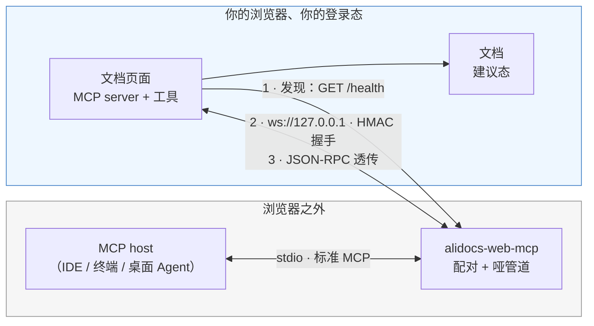
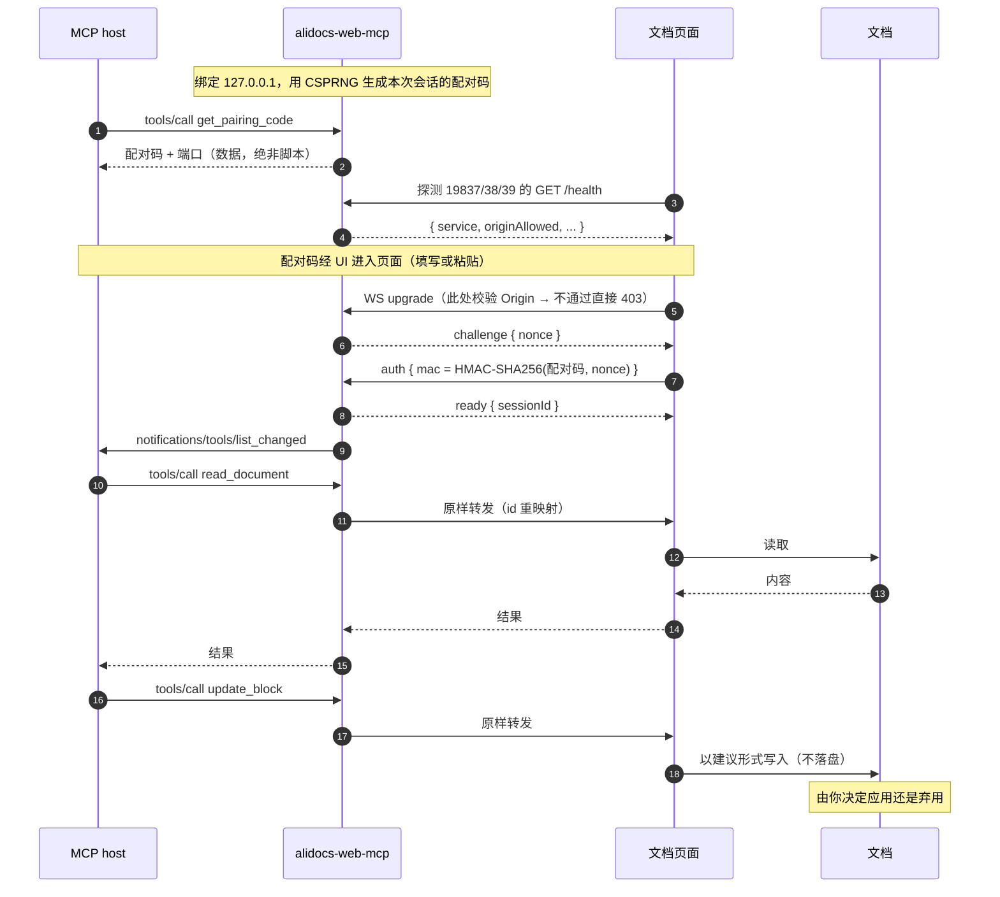

# alidocs-web-mcp

**让 AI Agent 直接读写你此刻正打开的那份钉钉文档 —— 在你自己的浏览器里、用你自己的登录态，所有修改都以建议形式呈现，由你决定应用还是弃用。**

[](https://www.npmjs.com/package/alidocs-web-mcp)
[](https://github.com/magical-index/alidocs-web-mcp/actions/workflows/ci.yml)
[](./LICENSE)
[](https://nodejs.org)

[English](./README.md)

---

## 为什么需要它

你在浏览器里编辑文档，而 AI Agent 在别处 —— IDE、终端、桌面客户端。想让 Agent 帮你改，通常只有两条路，且都不好走：

| 做法 | 问题在哪 |
| --- | --- |
| 走服务端文档 API | 表达不了「**待人工裁决的块级建议**」这种语义，还要另配一套凭证与权限 |
| 让 Agent 自己开个浏览器 | 会话被劈成两半：你正在看的文档，和 Agent 操作的文档不是同一个 |

你真正想要的能力 —— 结构化块级编辑、且渲染成**可审阅的建议** —— 只存在于**页面运行时**里。所以本项目不去别处重造它，而是把 Agent 接到**你已经打开的那个页面**上。

**方向是刻意反转的**：由页面主动向外连本地进程，本地进程从不反向伸进浏览器。正因如此，它不需要调试端口、不需要装浏览器扩展、也不需要改动你 Agent 所在的宿主程序。

## 你会得到什么

- **标准 MCP over stdio** —— 任意 MCP host（IDE / 终端 / 桌面 Agent）都能接，不必迁就自创协议
- **零运行时依赖** —— 纯 Node ≥ 22.12，手写 WebSocket 帧编解码，`npx` 直接跑
- **零代码注入** —— 配对凭证是**数据**，不是脚本，全程不 `eval` 任何东西
- **默认只读** —— 写能力需显式开启，且落地为建议而非直接保存
- **只监听环回地址** —— 绑定 `127.0.0.1`，校验 Origin 白名单，握手走 HMAC 挑战-响应

## 前置条件

> [!IMPORTANT]
> 这个桥只是**一半**。文档页面侧必须有配套的连接器来发现它并发起配对。缺了页面侧，桥能正常启动，但文档工具永远不会出现。
>
> 目前该连接器在生产环境的钉钉文档中尚未全量开放。如果桥明显在运行、`get_bridge_status` 却一直是 `connected: false`，几乎可以肯定是这个原因，不是你配置错了。

- Node.js ≥ 22.12（本包是 ESM-only；CommonJS 调用方在 22.12+ 上可直接 `require()`）
- 浏览器里打开的钉钉文档页面，且页面侧连接器已就位

## 安装与运行

注册到你的 MCP host，无需全局安装：

```json
{
  "mcpServers": {
    "alidocs-web-mcp": {
      "command": "npx",
      "args": ["-y", "alidocs-web-mcp", "--allow-write"]
    }
  }
}
```

也可以直接跑：

```bash
npx -y alidocs-web-mcp               # 只读
npx -y alidocs-web-mcp --allow-write # 允许页面注册写工具
```

桥会依次尝试 **19837 → 19838 → 19839**，用第一个空闲端口。页面靠探测这几个固定端口来发现它 —— 这也是端口固定而非随机的原因。

## 配对流程

三步，Agent 可以全程自己完成：

1. 调 `get_pairing_code` → 拿到**配对码（一串数据）**和端口
2. 把配对码填进页面的「本地 Agent」配对框 —— Agent 可以自己填写并点击，你也可以手动粘贴
3. 页面完成 HMAC 握手，此后 `tools/list` 就会包含文档工具

刷新页面或同标签内跳转后，页面会用存在 `sessionStorage` 里的配对码自动重连，不需要再配对一次。

## 架构



两个值得留意的性质：

- **永远由页面发起**。桥只在环回地址上监听，从不主动连浏览器。
- **桥是哑管道**。除自有的三个工具外，它只做 `tools/list` 合并与 `tools/call` 原样转发，不理解文档语义 —— 因此页面新增工具无需改桥。

## 数据流



配对码本身从不上线，网络上只出现 `HMAC(配对码, nonce)`。即便有人抢占端口并截获了 mac，也反推不出配对码。

## 桥自有工具

`tools/list` 里其余的工具都来自页面，桥只负责转发。

| 工具 | 作用 |
| --- | --- |
| `get_pairing_code` | 返回配对码（数据）、端口与写权限状态。**绝不返回脚本。** |
| `get_bridge_status` | 端口、是否已配对、页面 MCP 会话是否就绪、在途请求数、Origin 白名单、审计日志路径。调用失败时先查这里。 |
| `revoke_session` | 轮换配对码并断开会话，页面存的旧码立即失效。 |
| `call_page_tool` | 静态透传兜底。部分 MCP host 在桥发送 `notifications/tools/list_changed` 后不会刷新工具清单，导致页面工具不可见。该工具恒定存在，只按 `{name, arguments}` 原样转发给页面，因此即使 host 的工具快照过期，也能直接调用 `read_document` / `insert_blocks` 等页面工具。 |

## CLI 参数

| 参数 | 说明 |
| --- | --- |
| `--port <n>` | 只用该端口，不走候选集 |
| `--allow-origin <pattern>` | 追加白名单条目（可重复）；`*` 只匹配单个 label 或端口，不跨 `.` `:` `/` |
| `--only-origin <pattern>` | 完全替换默认白名单 |
| `--allow-write` | 允许页面注册写工具（否则只读） |
| `--audit-log <path>` / `--no-audit` | 审计日志位置，默认 `~/.alidocs-web-mcp/audit.log` |
| `--handshake-timeout-ms <n>` | 握手时限，默认 10000 |
| `--request-timeout-ms <n>` | 转发给页面的请求超时，默认 60000 |

默认白名单只逐条枚举官方文档域与本地开发域，**刻意不做** `https://*.dingtalk.com` 这类通配 —— 否则任意子域页面都能连上你的本地桥。

## 安全设计

这个工具会在你机器上开监听端口，所以有必要讲清楚。四个攻击方向，各有对应防御：

| 方向 | 防御 |
| --- | --- |
| 恶意网页 → 你的本地桥 | 只绑环回地址，**并且**在 WS upgrade 阶段校验 Origin 白名单（在任何状态变更之前 403） |
| 本地恶意进程 → 桥 | 每会话一份 CSPRNG 配对码。非浏览器客户端可以伪造 Origin，但猜不出配对码 |
| 抢占端口的本地冒充者 → 你的页面 | HMAC 挑战-响应，配对码不上线；外加端口占用检测 |
| 被污染的分发或提示注入 → 你的页面 | 凭证以数据传递而非代码；默认只读；写操作只产生建议 |

此外：`/health` 按 Origin 分级（白名单外读不到 `connected` / `allowWrite`）；同时只维持一个会话；审计日志只记工具名与参数的 **key**，绝不记参数值与配对码。

完整威胁模型与 S1–S13 措施清单见 **[docs/security.md](./docs/security.md)**；漏洞上报见 **[SECURITY.md](./SECURITY.md)**。

## 排查

| 现象 | 可能原因 |
| --- | --- |
| `tools/list` 只有桥工具 | 还没有页面配对成功。调 `get_pairing_code` 走完配对。若页面已配对但 host 仍看不到文档工具，可能是 host 不刷新 `tools/list`，可用 `call_page_tool` 兜底。 |
| `get_bridge_status` 一直 `connected: false` | 页面没有连接器（见[前置条件](#前置条件)），或页面所在 origin 不在白名单里。 |
| `ORIGIN_REJECTED` | 你的文档 origin 未被放行，用 `--allow-origin` 加上。 |
| `PORT_CONTENDED` | 三个候选端口都被占了。腾一个，或用 `--port` 指定。 |
| 重启桥后立刻 `AUTH_FAILED` | 预期行为：重启会轮换配对码，用新码重新配对。 |
| 调用中途 `PAGE_DISCONNECTED` | 页面跳转或刷新了。它会自己重连，重试即可。 |
| `PAGE_TIMEOUT` | 页面在 `--request-timeout-ms` 内没有响应。 |

## 开发

```bash
npm install       # 只装开发依赖（TypeScript、Vitest、Biome、publint、attw）
npm run build     # tsc -p tsconfig.build.json → dist/（ESM + .d.ts）
npm test          # Vitest：单元 + e2e 测 src/，另加一组产物 smoke 测 dist/
npm run typecheck # tsc --noEmit，覆盖 src/ 与 test/
npm run lint      # Biome（lint + 格式校验）；要自动修就 npm run lint:fix
npm run verify    # lint → typecheck → build → test → 包形状校验（提 PR 前必跑）
```

**技术栈**：TypeScript 7 · Vitest 4 · Biome 2 · publint + [`attw`](https://github.com/arethetypeswrong/arethetypeswrong.github.io)——全部只在开发期，发布产物仍是**零**运行时依赖。

源码是 `src/` 下的 TypeScript，发布形态为 **ESM-only** 的扁平 `dist/`。测试同样是 TypeScript：单元与 e2e 直接 import `src/`，契约被改坏会在类型检查阶段就报，而不是等断言跑到 `undefined` 上。编译本身能弄坏的东西——shebang 丢失、`exports` 指向不存在的文件、`vectors.json` 没拷、在 ESM 下失效的写法（如 `__dirname`）——由 [`test/artifact.test.ts`](./test/artifact.test.ts) 单独守：它会在产物过期时自动重建，并拉起真实 CLI 进程跑 stdio 握手。因为桥用固定端口集，测试必须串行执行。

下游项目可以基于真实桥进程做契约测试：

```ts
import { startTestBridge, connectFakePage, readyOf } from 'alidocs-web-mcp/testing';
```

另见 [CONTRIBUTING.md](./CONTRIBUTING.md) 与 [AGENT.md](./AGENT.md)（后者列出了不可违背的约束，例如"绝不返回可执行代码"）。

## 项目状态

早期（0.x）。目前已验证：

- 56 个自动化用例：单元 + 端到端测源码，另有一组产物 smoke 拉起真实 CLI 进程验证发布形态
- 12 类 Origin 绕过尝试（子域拼接、整 URL 塞进 Origin、尾部点、大写变体、协议降级、`null`、缺失、端口注入、反斜杠混淆等）在真实 upgrade 路径上全部被拒
- 握手前发送的业务消息会被拒绝并关闭连接
- 与页面侧的 HMAC 跨实现一致性，由共享测试向量钉住

**已知限制**：少数 MCP host 在 server 启动时抓一次 `tools/list` 快照，之后不再响应桥发送的 `notifications/tools/list_changed`。如果你的 host 在页面配对后仍看不到文档工具，可使用桥自有的 `call_page_tool`，按名字调用 `read_document` / `insert_blocks` 等页面工具——桥仍原样转发参数，不解释文档语义。

## 文档

- [docs/design.md](./docs/design.md) —— 设计、取舍，以及三个不可拆分的耦合
- [docs/security.md](./docs/security.md) —— 威胁模型与措施清单
- [AGENT.md](./AGENT.md) —— AI Agent 在本仓工作的约定
- [CHANGELOG.md](./CHANGELOG.md)

## License

[MIT](./LICENSE)
