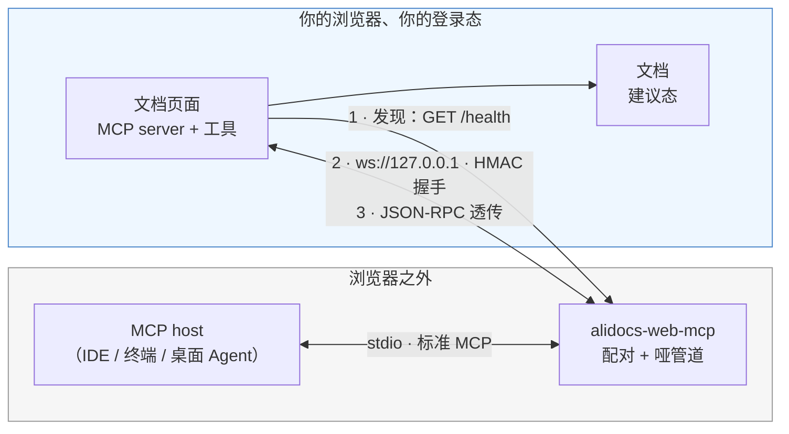
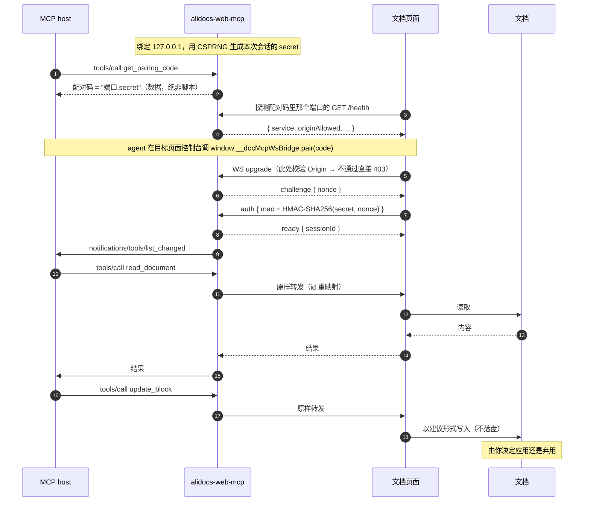

# alidocs-web-mcp

**让 AI Agent 直接读写你此刻正打开的那份钉钉文档 —— 在你自己的浏览器里、用你自己的登录态，所有修改都以建议形式呈现，由你决定应用还是弃用。**

[](https://www.npmjs.com/package/@magical-index/alidocs-web-mcp)
[](https://github.com/magical-index/alidocs-web-mcp/actions/workflows/ci.yml)
[](./LICENSE)
[](https://nodejs.org)

[English](./README.md)

---

## 为什么需要它

你在浏览器里编辑文档，而 AI Agent 在别处 —— IDE、终端、桌面客户端。想让 Agent 帮你改，通常只有两条路，且都不好走：

| 做法 | 问题在哪 |
| --- | --- |
| 走服务端文档 API | 表达不了「**待人工裁决的块级建议**」这种语义，还要另配一套凭证与权限 |
| 让 Agent 自己开个浏览器 | 会话被劈成两半：你正在看的文档，和 Agent 操作的文档不是同一个 |

你真正想要的能力 —— 结构化块级编辑、且渲染成**可审阅的建议** —— 只存在于**页面运行时**里。所以本项目不去别处重造它，而是把 Agent 接到**你已经打开的那个页面**上。

**方向是刻意反转的**：由页面主动向外连本地进程，本地进程从不反向伸进浏览器。正因如此，它不需要调试端口、不需要装浏览器扩展、也不需要改动你 Agent 所在的宿主程序。

## 你会得到什么

- **标准 MCP over stdio** —— 任意 MCP host（IDE / 终端 / 桌面 Agent）都能接，不必迁就自创协议
- **零运行时依赖** —— 纯 Node ≥ 22.12，手写 WebSocket 帧编解码，`npx` 直接跑
- **零代码注入** —— 配对凭证是**数据**，不是脚本，全程不 `eval` 任何东西
- **默认只读** —— 写能力需显式开启，且落地为建议而非直接保存
- **只监听环回地址** —— 绑定 `127.0.0.1`，校验 Origin 白名单，握手走 HMAC 挑战-响应

## 前置条件

> [!IMPORTANT]
> 这个桥只是**一半**。文档页面侧必须有配套的连接器来发现它并在 agent 指示时配对。连接器不会自己弹任何 UI；由 agent 在该页面调 `window.__docMcpWsBridge.pair(配对码)` 发起配对。缺了页面侧连接器，桥能正常启动，但文档工具永远不会出现。
>
> 目前该连接器在生产环境的钉钉文档中尚未全量开放。如果桥明显在运行、`get_bridge_status` 却一直是 `connected: false`，几乎可以肯定是这个原因，不是你配置错了。

- Node.js ≥ 22.12（本包是 ESM-only；CommonJS 调用方在 22.12+ 上可直接 `require()`）
- 浏览器里打开的钉钉文档页面，且页面侧连接器已就位

## 安装与运行

**一键安装**（校验 Node、预热 npx 缓存、注册 MCP server）：

```bash
curl -fsSL https://raw.githubusercontent.com/magical-index/alidocs-web-mcp/main/install.sh | sh
# 允许写工具：
curl -fsSL https://raw.githubusercontent.com/magical-index/alidocs-web-mcp/main/install.sh | sh -s -- --allow-write
```

检测到 `claude` CLI 时会自动注册进 **Claude Code**（`claude mcp add --scope user`），并为 **Qoder** 打印可直接粘贴的 JSON 片段（Settings → MCP → **+ Add**）。更多选项见 `install.sh --help`（`--name`、`--force`、`--skip-verify`）。

或手动注册到你的 MCP host，无需全局安装：

```json
{
  "mcpServers": {
    "alidocs-web-mcp": {
      "command": "npx",
      "args": ["-y", "@magical-index/alidocs-web-mcp", "--allow-write"]
    }
  }
}
```

也可以直接跑：

```bash
npx -y @magical-index/alidocs-web-mcp               # 只读
npx -y @magical-index/alidocs-web-mcp --allow-write # 允许页面注册写工具
```

默认情况下桥会依次尝试 **19837 → 19838 → 19839**，用第一个空闲端口。但端口不再是**身份**：自 0.2.0 起配对码的形状是 `<port>.<secret>`，页面直接连码里点名的那个端口，不再逐个探候选集。

### 同时跑多个 Agent

每个 Agent 宿主都会各起一个桥，三个固定端口很快就不够用——第四个启动直接报 `PORT_CONTENDED`；更麻烦的是页面只能发现占住第一个端口的那个桥。加 `--port 0` 让 OS 分配一个空闲的临时端口即可，端口已写在配对码里，其余什么都不用改：

```json
{
  "mcpServers": {
    "alidocs-web-mcp": {
      "command": "npx",
      "args": ["-y", "@magical-index/alidocs-web-mcp", "--port", "0", "--allow-write"]
    }
  }
}
```

前提是**桥 ≥ 0.2.0**，且页面侧连接器认识这种复合码。老版本的桥只下发裸 secret，页面会退回逐个探候选端口——正是你想躲开的那种争抢。注意**全局安装的桥不会像 `npx -y` 那样自动更新**，需要显式升级：

```bash
npm i -g @magical-index/alidocs-web-mcp@latest
```

### 配套 skill（可选，需手动安装）

`skills/alidocs-edit-routing/` 是一份 Agent Skill：改已有钉钉文字文档前，让 agent 先问你走「dws 直改」还是「本桥建议态」，而不是闷头选一条直接落盘。它随 npm 包发布，但**不会自动生效**——得自己放到 host 的 skills 目录。

各 host 都是「一个目录一个 skill」，且**目录名必须与 `SKILL.md` 里的 `name` 一致**：

| Host | skills 目录 |
| --- | --- |
| Claude Code | `~/.claude/skills/` |
| Codex | `~/.agents/skills/` |
| Qoder | `~/.qoder/skills/` |

从已全局安装的包里软链（推荐：升包后 skill 跟着更新）：

```bash
SKILL="$(npm root -g)/@magical-index/alidocs-web-mcp/skills/alidocs-edit-routing"
ln -s "$SKILL" ~/.claude/skills/alidocs-edit-routing
```

用 `npx -y` 跑桥的没有稳定的本地包路径，从仓库取：

```bash
git clone https://github.com/magical-index/alidocs-web-mcp.git
ln -s "$PWD/alidocs-web-mcp/skills/alidocs-edit-routing" ~/.claude/skills/alidocs-edit-routing
```

两件事需要注意：**新开一个会话才生效**（host 在会话启动时读 skills 目录）；它把 `dws` 当作前置 skill，没有 dws 时「直改」那条通道走不通。若你装的包版本早于该目录引入，`skills/` 不存在，请升级或直接从仓库取。

## 配对流程

三步，Agent 可以全程自己完成：

1. 调 `get_pairing_code` → 拿到**配对码（一串数据）**，端口已经以 `<port>.<secret>` 的形式含在里面
2. Agent 在**目标页面**（通常是文档 iframe 的 `contentWindow`）的控制台跑一行：`await window.__docMcpWsBridge.pair(配对码)`。只有 Agent 点名的那个页面会连上——连接器不会自己弹面板，其它浏览器/标签页保持静默
3. 页面完成 HMAC 握手，此后 `tools/list` 就会包含文档工具

刷新页面或同标签内跳转后，页面会用存在 `sessionStorage` 里的配对码自动重连，不需要再配对一次。

## 架构



两个值得留意的性质：

- **永远由页面发起**。桥只在环回地址上监听，从不主动连浏览器。
- **桥是哑管道**。除自有的少数几个工具外，它只做 `tools/list` 合并与 `tools/call` 原样转发，不理解文档语义 —— 因此页面新增工具无需改桥。

## 数据流



配对码的 secret 段从不上线，网络上只出现 `HMAC(secret, nonce)`。即便有人抢占端口并截获了 mac，也反推不出 secret。（端口段不是凭证，它只说明「该连哪个桥」。）

## 桥自有工具

`tools/list` 里其余的工具都来自页面，桥只负责转发。

| 工具 | 作用 |
| --- | --- |
| `get_pairing_code` | 返回配对码（数据，形状为 `<port>.<secret>`，页面据此连**本进程**而不是「谁先应答连谁」）、端口与写权限状态。**绝不返回脚本。** |
| `get_bridge_status` | 端口、是否已配对、页面 MCP 会话是否就绪、在途请求数、Origin 白名单、审计日志路径。调用失败时先查这里。 |
| `revoke_session` | 轮换配对码并断开会话，页面存的旧码立即失效。 |
| `list_page_tools` | 静态兜底之一。只读列出已建桥页面提供的工具（名字、描述、参数 schema），供工具快照过期的 host 先发现再调用。 |
| `call_page_tool` | 静态透传兜底。部分 MCP host 在桥发送 `notifications/tools/list_changed` 后不会刷新工具清单，导致页面工具不可见。它只按 `{name, arguments}` 原样转发给页面，因此即使 host 的工具快照过期，也能直接调用 `read_document` / `insert_blocks` 等页面工具。 |

最后两个是**静态兜底工具**，是否出现由 `--host-profile` 决定：`auto`（默认）下只对**确信遵守 `tools/list_changed` 的 host**（目前仅 Claude 系）隐藏，未知 host 一律当作不遵守而暴露——宁可多两个工具的噪音，也不让真需要兜底的 host 看不到工具。

## CLI 参数

| 参数 | 说明 |
| --- | --- |
| `--port <n>` | 只用该端口，不走候选集。`--port 0` 表示「OS 给哪个空闲端口就用哪个」——多个 Agent 各起一个桥时推荐这么配 |
| `--allow-origin <pattern>` | 追加白名单条目（可重复）；`*` 只匹配单个 label 或端口，不跨 `.` `:` `/` |
| `--only-origin <pattern>` | 完全替换默认白名单 |
| `--allow-write` | 允许页面注册写工具（否则只读） |
| `--host-profile <p>` | 静态兜底工具画像：`auto`（默认，未知 host 露兜底）/ `static`（总是露，给不刷新工具清单的 host）/ `standard`（从不露） |
| `--audit-log <path>` / `--no-audit` | 审计日志位置，默认 `~/.alidocs-web-mcp/audit.log` |
| `--handshake-timeout-ms <n>` | 握手时限，默认 10000 |
| `--request-timeout-ms <n>` | 转发给页面的请求超时，默认 60000 |

默认白名单只逐条枚举官方文档域与本地开发域，**刻意不做** `https://*.dingtalk.com` 这类通配 —— 否则任意子域页面都能连上你的本地桥。

## 安全设计

这个工具会在你机器上开监听端口，所以有必要讲清楚。四个攻击方向，各有对应防御：

| 方向 | 防御 |
| --- | --- |
| 恶意网页 → 你的本地桥 | 只绑环回地址，**并且**在 WS upgrade 阶段校验 Origin 白名单（在任何状态变更之前 403） |
| 本地恶意进程 → 桥 | 每会话一份 CSPRNG 配对码。非浏览器客户端可以伪造 Origin，但猜不出配对码 |
| 抢占端口的本地冒充者 → 你的页面 | HMAC 挑战-响应，配对码不上线；外加端口占用检测 |
| 被污染的分发或提示注入 → 你的页面 | 凭证以数据传递而非代码；默认只读；写操作只产生建议 |

此外：`/health` 按 Origin 分级（白名单外读不到 `connected` / `allowWrite`）；同时只维持一个会话；审计日志只记工具名与参数的 **key**，绝不记参数值与配对码。

完整威胁模型与 S1–S13 措施清单见 **[docs/security.md](./docs/security.md)**；漏洞上报见 **[SECURITY.md](./SECURITY.md)**。

## 排查

| 现象 | 可能原因 |
| --- | --- |
| `tools/list` 只有桥工具 | 还没有页面配对成功。调 `get_pairing_code` 走完配对。若页面已配对但 host 仍看不到文档工具，先用 `list_page_tools` 发现工具与参数，再用 `call_page_tool` 按名调用；若这两个兜底工具也不在清单里，用 `--host-profile static` 强制暴露。 |
| `get_bridge_status` 一直 `connected: false` | agent 还没在页面控制台调 `window.__docMcpWsBridge.pair(配对码)`，或页面没有连接器（见[前置条件](#前置条件)），或页面所在 origin 不在白名单里。 |
| `ORIGIN_REJECTED` | 你的文档 origin 未被放行，用 `--allow-origin` 加上。 |
| `PORT_CONTENDED` | 三个候选端口都被占了，通常是被别的 Agent 的桥占着。用 `--port 0`（见[同时跑多个-agent](#同时跑多个-agent)），或腾一个出来。 |
| 重启桥后立刻 `AUTH_FAILED` | 预期行为：重启会轮换配对码，用新码重新配对。 |
| 调用中途 `PAGE_DISCONNECTED` | 页面跳转或刷新了。它会自己重连，重试即可。 |
| `PAGE_TIMEOUT` | 页面在 `--request-timeout-ms` 内没有响应。 |

## 开发

```bash
npm install       # 只装开发依赖（TypeScript、Vitest、Biome、publint、attw）
npm run build     # tsc -p tsconfig.build.json → dist/（ESM + .d.ts）
npm test          # Vitest：单元 + e2e 测 src/，另加一组产物 smoke 测 dist/
npm run typecheck # tsc --noEmit，覆盖 src/ 与 test/
npm run lint      # Biome（lint + 格式校验）；要自动修就 npm run lint:fix
npm run verify    # lint → typecheck → build → test → 包形状校验（提 PR 前必跑）
```

**技术栈**：TypeScript 7 · Vitest 4 · Biome 2 · publint + [`attw`](https://github.com/arethetypeswrong/arethetypeswrong.github.io)——全部只在开发期，发布产物仍是**零**运行时依赖。

源码是 `src/` 下的 TypeScript，发布形态为 **ESM-only** 的扁平 `dist/`。测试同样是 TypeScript：单元与 e2e 直接 import `src/`，契约被改坏会在类型检查阶段就报，而不是等断言跑到 `undefined` 上。编译本身能弄坏的东西——shebang 丢失、`exports` 指向不存在的文件、`vectors.json` 没拷、在 ESM 下失效的写法（如 `__dirname`）——由 [`test/artifact.test.ts`](./test/artifact.test.ts) 单独守：它会在产物过期时自动重建，并拉起真实 CLI 进程跑 stdio 握手。因为桥用固定端口集，测试必须串行执行。

下游项目可以基于真实桥进程做契约测试：

```ts
import { startTestBridge, connectFakePage, readyOf } from '@magical-index/alidocs-web-mcp/testing';
```

另见 [CONTRIBUTING.md](./CONTRIBUTING.md) 与 [AGENT.md](./AGENT.md)（后者列出了不可违背的约束，例如"绝不返回可执行代码"）。

## 项目状态

早期（0.x）。目前已验证：

- 75 个自动化用例：单元 + 端到端测源码，另有一组产物 smoke 拉起真实 CLI 进程验证发布形态
- 12 类 Origin 绕过尝试（子域拼接、整 URL 塞进 Origin、尾部点、大写变体、协议降级、`null`、缺失、端口注入、反斜杠混淆等）在真实 upgrade 路径上全部被拒
- 握手前发送的业务消息会被拒绝并关闭连接
- 与页面侧在 HMAC 与配对码解析规则两处的跨实现一致性，由共享测试向量钉住

**已知限制**：少数 MCP host 在 server 启动时抓一次 `tools/list` 快照，之后不再响应桥发送的 `notifications/tools/list_changed`。因为 MCP 规范里没有声明该能力的标准字段，桥只能在 `initialize` 阶段靠 `clientInfo` 保守判定：**未知 host 一律当作不遵守**，因此默认就会露出 `list_page_tools` / `call_page_tool` 两个静态兜底工具——先用前者发现页面工具与参数，再用后者按名调用（桥仍原样转发参数，不解释文档语义）。

## 文档

- [skills/alidocs-edit-routing/](./skills/alidocs-edit-routing/SKILL.md) —— 配套 skill：改文档前先在「dws 直改」与「交互式审批」之间路由
- [docs/design.md](./docs/design.md) —— 设计、取舍，以及三个不可拆分的耦合
- [docs/security.md](./docs/security.md) —— 威胁模型与措施清单
- [AGENT.md](./AGENT.md) —— AI Agent 在本仓工作的约定
- [CHANGELOG.md](./CHANGELOG.md)

## License

[MIT](./LICENSE)
